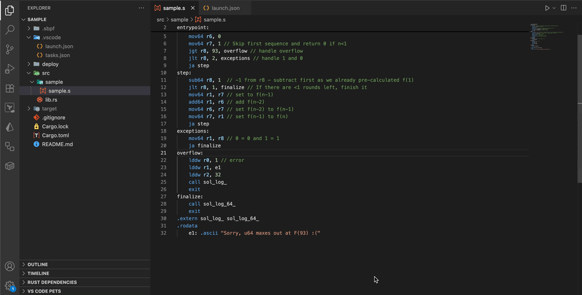

# sBPF Debugger

An interactive debugger for Solana sBPF programs.

## Features

- Execution control (step/continue)
- Breakpoint support
- Register inspection and modification
- Compute Units (CU) tracking
- Error handling
- REPL interface
- VSCode debug adapter


## Installation

```bash
cargo install --git https://github.com/bidhan-a/sbpf-dbg
```

### Solana Platform Tools

The debugger requires Solana platform tools to build assembly files with debug information enabled. Please make sure to download the latest release from [here](https://docs.solanalabs.com/cli/install).


## Usage

### Example
```bash
sbpf-dbg --file src/sample/sample.s
sbpf-dbg --file src/sample/sample.s --linker src/sample/custom.ld
sbpf-dbg --file src/sample/sample.s --input .dbg/sample_input.hex
```

### Program Input
sBPF programs require input parameters to be serialized into a specific byte array format. This array is then passed to the program’s entrypoint, where the program is responsible for deserializing it on-chain.

Use the [sbpf-debugger-input](crates/debugger-input/) package to generate serialized input for your program, if input is required.

### Command Line Options
- `-f, --file <FILE>`: Path to the assembly file (.s)
- `-l, --linker <FILE>`: Path to custom linker file (.ld) (optional)
- `--input <FILE>`: Path to input hex file (optional)


## REPL

Once the debugger starts, you'll see a `dbg>` prompt. Here are the available commands:

### Execution Control
| Command | Alias | Description |
|---------|-------|-------------|
| `step` | `s` | Execute one instruction |
| `continue` | `c` | Continue execution until breakpoint or exit |

### Breakpoints
| Command | Description |
|---------|-------------|
| `lines` | Show lines |
| `break <line>` | Set breakpoint at line number |
| `delete <line>` | Remove breakpoint at line |
| `info breakpoints` | Show all breakpoints |

### Register Operations
| Command | Description |
|---------|-------------|
| `regs` | Display all registers in table format |
| `reg <idx>` | Display specific register. |
| `setreg <idx> <value>` | Set register value (supports hex with 0x prefix) |

### Utility
| Command | Description |
|---------|-------------|
| `help` | Show command help |
| `quit` | Exit debugger |


## VSCode Debugger
The VSCode debugger extension is inside the `extension` directory. 

### Demo



-----

## TODO

- [x] Track compute units usage
- [x] Integrate the assembly build process into the debugger
- [x] Handle serialized input
- [ ] Add all syscalls
- [ ] ...

